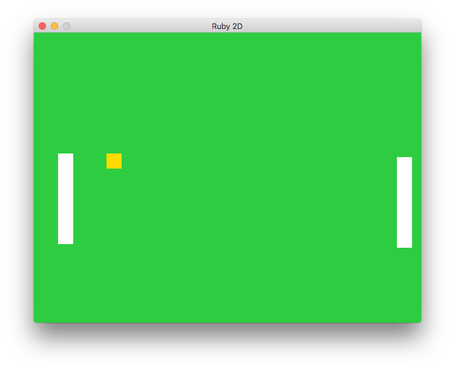
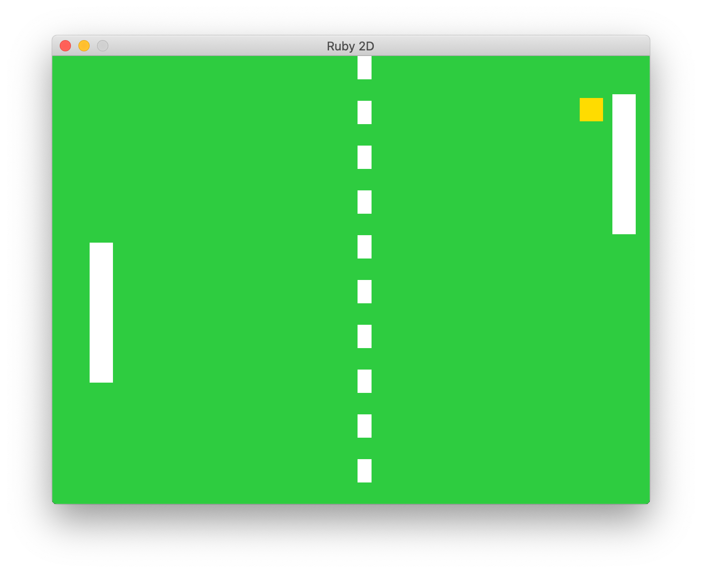

# Pong

Hit the ball with your paddle and try and get it past your opponent.

## Version 1

The first version of this game has the basic game mechanics but is missing scoring and has very simple logic for the trajectory of the ball.

## Version 2

The second version of the game fixes a bug where the ball would be stuck on the paddle, it improves the keyboard controls as well as makes the opponent movement smoother.

The major changes in version two are the added music and sound effects as well as more realstic deflection of the ball when it hits the paddle making the gameploy more enjoyable.

The game looks very similar, though it now has a dotted line drawn down the centre.

## Version 3

We now make the AI smarter by having it follow the trajectory of the ball, rather than where the ball is currently at. To achieve this we need to calculate where the ball is going and figure out if it's going to bounce off the wall.

Once the ball is hit by either the player or the opponent, the opponent will think for a moment and then start following where it calculates the ball will end up.

## Version 4

Add support to control the player via a gamepad as well as the keyboard
