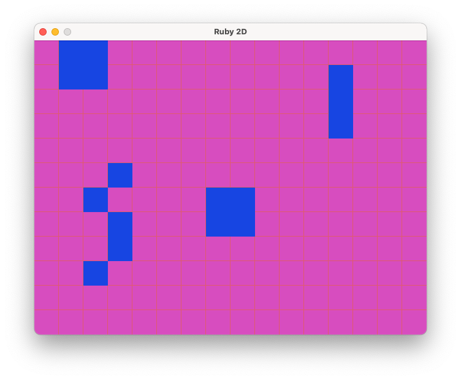

## Conway's game of life

You can find information about how the simulation works at Wikipedia: https://en.wikipedia.org/wiki/Conway%27s_Game_of_Life

### How to play

Click on the squares that you want to be alive to start with, when ready press the 'P' key on the keyboard to play the simulation and press 'P' again to pause. If you want to start over again press the 'C' key to clear the alive squares.

